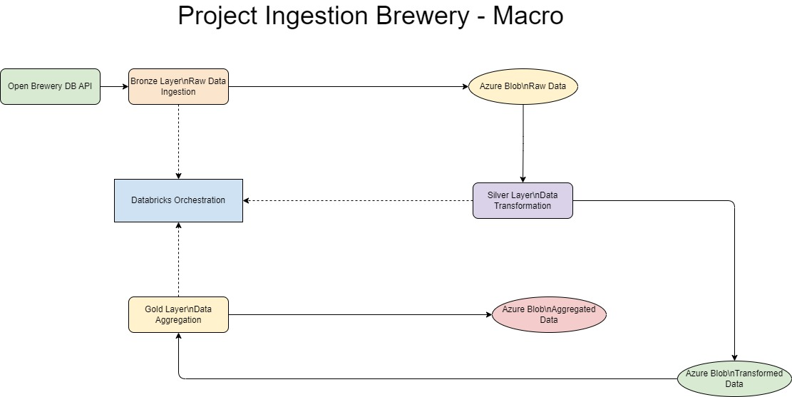

# AB InBev Data Engineering Case

**IMPORTANT**: Before diving into this repository, 
               please read the detailed documentation 
			   in the file [leiame primeiro.pdf](leiame%20primeiro.pdf), where all decisions and processes are thoroughly explained.
**OTHER**: In the docs/ folder there is documentation called additional_docs.md, where I suggest more steps for this project, such as data-marts, databases and data science
---

## Pipeline Diagram



---

## Features

### Pipeline
- **Bronze Layer**: Ingest raw data from the Open Brewery DB API and store it in Azure Blob Storage.
- **Silver Layer**: Clean and transform the raw data into a structured format.
- **Gold Layer**: Aggregate and prepare the data for analytics.

### Testing
- Unit tests for each layer (Bronze, Silver, Gold).
- End-to-end pipeline testing.
- Performance testing with large datasets.

### Orchestration
- Managed with Databricks to execute sequential processes with error handling and retries.

---

## Repository Structure

```
project-root/
├── README.md                 # Project documentation
├── requirements.txt          # Python dependencies
├── src/                      # Source code for pipeline layers
│   ├── bronze.py             # Bronze layer script
│   ├── silver.py             # Silver layer script
│   ├── gold.py               # Gold layer script
│   └── orchestration.py      # Pipeline orchestration script
├── tests/                    # Test scripts for the pipeline
│   ├── test_bronze.py        # Bronze layer tests
│   ├── test_silver.py        # Silver layer tests
│   ├── test_gold.py          # Gold layer tests
│   ├── test_endtoend.py      # End-to-end pipeline test
│   └── test_performance.py   # Performance test
├── Docker/                   # Dockerfiles for each layer
│   ├── Dockerfile.bronze     # Bronze layer Dockerfile
│   ├── Dockerfile.silver     # Silver layer Dockerfile
│   ├── Dockerfile.gold       # Gold layer Dockerfile
├── leiame primeiro.pdf       # Detailed decision-making documentation
└── docs/                     # Documentation and diagrams
    ├── pipeline_solution.jpg # Diagram of the pipeline
    └── additional_docs.md    # Additional documentation (contains extra project ideas)
```

---

## Installation

1. Clone the repository:
   ```bash
   git clone https://github.com/your-repo/abinbev-data-pipeline.git
   cd abinbev-data-pipeline
   ```

2. Install dependencies:
   ```bash
   pip install -r requirements.txt
   ```

---

## Usage

### Running the Pipeline
1. Deploy the scripts to Databricks.
2. Execute the orchestration script:
   ```python
   python src/orchestration.py
   ```

### Running Tests
Run the tests using `pytest`:
```bash
pytest tests/
```

---

## License
This project is licensed under the MIT License. See the `LICENSE` file for details.
